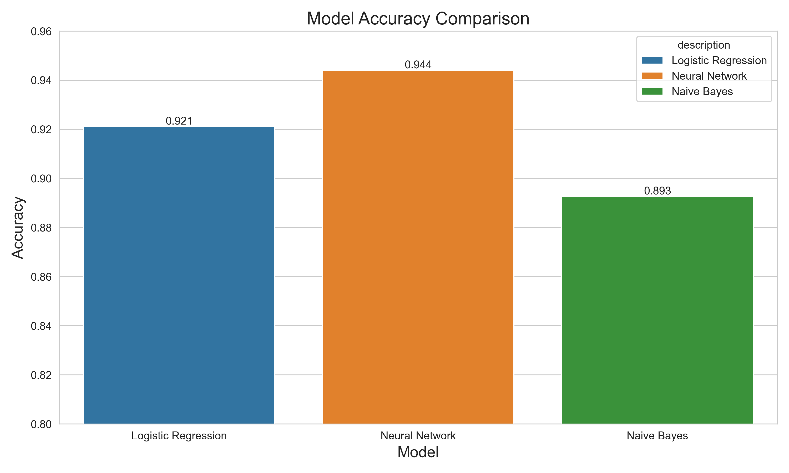

# Assignment 2: Text Classification Benchmarks

This project implements text classification benchmarks on the Fake News Dataset. It evaluates three different classification models (logistic regression, neural network, and naive bayes) and compares their performance on detecting fake news.

## Project Structure

```
.
├── README.md                       # This file
├── assignment_2_guidelines.md      # Assignment instructions
├── expected_knowledge.md           # Expected knowledge document
├── config.yaml                     # Configuration file for all settings
├── settings.py                     # Pydantic Settings configuration models
├── data/                           # Data directory
│   └── fake_or_real_news.csv       # Fake News dataset
├── models/                         # Saved models directory
├── output/                         # Output directory for classification reports
├── results/                        # Visualizations and comparison results
├── utils/                          # Utility package
│   ├── __init__.py                 # Package initialization
│   ├── common.py                   # Common helper functions
│   ├── data_utils.py               # Data loading and preprocessing
│   ├── model_utils.py              # Model operations and reporting
│   ├── vectorization_utils.py      # Text vectorization functions
│   └── visualization.py            # Visualization functions
├── pyproject.toml                  # Project dependencies
├── config_utils.py                 # Configuration loading utilities
├── main.py                         # Orchestration script
├── setup.sh                        # Environment setup script
├── run.sh                          # Run script for easy execution
├── vectorize_data.py               # Script to vectorize data
├── train_logistic_regression.py    # Logistic regression classifier
├── train_neural_network.py         # Neural network classifier
└── train_naive_bayes.py            # Naive Bayes classifier
```

## Quickstart

### Setup and Run

#### Easiest Method (One Step)
The simplest way to run the analysis:

```bash
# Just run this single command
./run.sh
```
When prompted for setup, simply press Enter to accept. This will set up the environment and run the analysis in one go.

#### Step-by-Step Alternative
If you prefer to run the process in separate steps:

```bash
# Step 1: Set up the environment (creates venv, installs deps)
./setup.sh

# Step 2 (Later): Run the analysis
./run.sh
```
This approach lets you set up the environment first and run the analysis at a later time.

### Configuration Options

This project uses Pydantic Settings for type-safe, validated configuration. The primary source is the `config.yaml` file, with environment variables as a fallback/override option.

#### Modifying Configuration

To change the project's configuration, edit the `config.yaml` file:

```yaml
# Example: Change vectorizer settings
vectorization:
  vectorizer_type: "count"  # Change from "tfidf" to "count"
  max_features: 5000        # Change from 10000 to 5000

# Example: Disable a model
models:
  naive_bayes:
    enabled: false          # Disable Naive Bayes model
```

The configuration controls:
- Data loading parameters
- Vectorization settings
- Model parameters
- Output options

#### Configuration in Code

The configuration is accessible through the `settings` singleton instance:

```python
from settings import settings

# Access configuration values
random_state = settings.data.random_state
vectorizer_type = settings.vectorization.vectorizer_type

# Check if a model is enabled
if settings.models.logistic_regression.enabled:
    # Train logistic regression model
    pass
```

#### Environment Variables

You can also override configuration values using environment variables with double underscore (`__`) delimiters:

```bash
# Override single values
export VECTORIZATION__MAX_FEATURES=5000
export MODELS__NAIVE_BAYES__ENABLED=false
```
## Analysis Details

This project performs binary classification on news articles to determine if they are fake (1) or real (0). The analysis involves:

1. **Data Preprocessing**:
   - Loading the Fake News dataset (6,335 articles)
   - Splitting into training and test sets (80/20)
   - Text vectorization using TF-IDF

2. **Model Training and Evaluation**:
   - Logistic Regression classifier with liblinear solver
   - Neural Network (MLP) classifier with ReLU activation and Adam optimizer
   - Multinomial Naive Bayes classifier with Laplace smoothing
   - Performance metrics include precision, recall, and F1-score

## Results

The analysis generates several outputs in the `results/` directory:



For detailed metrics, check the CSV report in `results/model_comparison.csv`.

### Output Files

The analysis generates files in two main directories:

#### Model Outputs (`output/` directory)
- **Classification Reports**: Text files containing precision, recall, F1-score, and support metrics for each individual model

#### Analysis Results (`results/` directory)
- **Comparison Visualizations**: Bar charts comparing model performance across different metrics
- **Tabular Results**: A CSV file with aggregated performance metrics for all models

Additionally, the system saves:
- **Trained Models**: Saved model files in the `models/` directory for future use or deployment
- **Vectorized Data**: Preprocessed and vectorized training/test data in the `data/vectorized/` directory

### Implementation Details

- The vectorization process uses TF-IDF with a default of 10,000 features
- Logistic Regression uses a C value of 1.0 and max iterations of 1,000
- Neural Network uses a two-layer architecture (100, 50) with early stopping
- Naive Bayes uses a smoothing parameter (alpha) of 1.0
- For reproducibility, a random seed of 42 is used throughout

## Code Organization

The codebase follows good software engineering principles:

- **Type-safe Configuration**: Uses Pydantic Settings for validated, typed configuration
- **Centralized Logging**: Uses a unified logging system configured through settings
- **Modular architecture**: Functionality is divided into focused modules
- **Utility package**: Common functions are organized in a dedicated utility package with specialized modules:
  - `common.py`: General helper functions like directory creation
  - `data_utils.py`: Functions for loading and preprocessing data
  - `vectorization_utils.py`: Functions for text vectorization operations
  - `model_utils.py`: Functions for saving/loading models and reports
  - `visualization.py`: Functions for creating performance visualizations
  - `logger.py`: Centralized logging configuration and setup
- **Separation of concerns**: Each component has a single responsibility
- **DRY principle**: Common code is extracted and reused

## Logging

The project uses a centralized logging system that provides consistent logging across all modules:

### Configuration

Logging is configured through the `settings.py`:

```python
# In settings.py or via environment variables
log_level: str = "INFO"  # Can be "DEBUG", "INFO", "WARNING", "ERROR", or "CRITICAL"
```

The logger outputs messages to the console with a simple format that includes the log level and message:
```
INFO: Loading Fake News dataset from data/fake_or_real_news.csv
WARNING: Maximum iterations reached without convergence
ERROR: Model file not found
```

## Requirements

- Python 3.12 or higher
- Dependencies (automatically installed by setup.sh):
  - scikit-learn
  - numpy
  - pandas
  - matplotlib
  - seaborn
  - pyyaml

## Troubleshooting

- **Issue**: `Permission denied` when running shell scripts
  **Solution**: Make the scripts executable with `chmod +x *.sh`

- **Issue**: Missing data file
  **Solution**: Ensure `fake_or_real_news.csv` is in the `data/` directory

## Author

Jacob Lillelund

## References

- Fake News Dataset: A collection of real and fake news articles used for text classification tasks.
