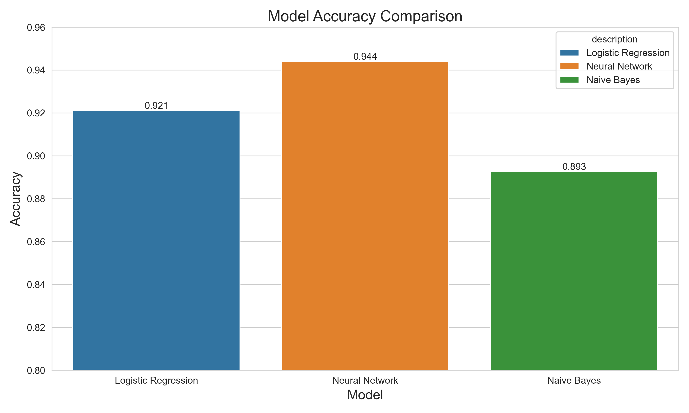
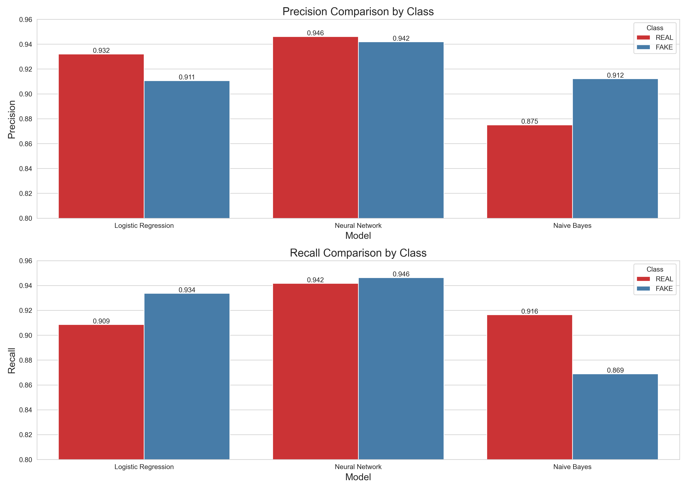
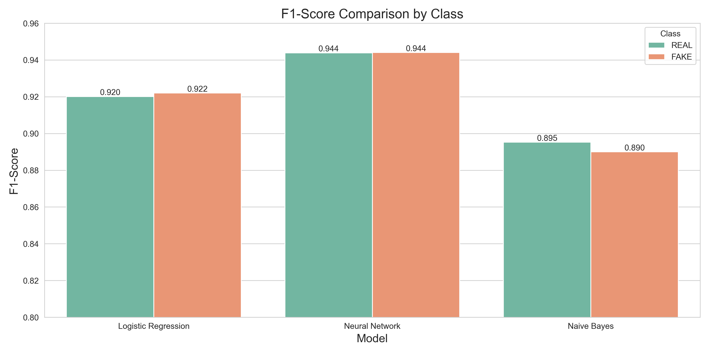

# Assignment 2: Text Classification Benchmarks

## Introduction

This project implements text classification benchmarks on the Fake News Dataset. It evaluates three different classification models (logistic regression, neural network, and naive bayes) and compares their performance on detecting fake news.

## Data

The analysis uses the Fake News dataset, containing 6,335 labeled news articles categorized as either real (0) or fake (1). Each article includes headline and text content. The dataset provides a balanced representation of both categories, making it suitable for binary classification tasks.

## Project Structure

```
.
├── README.md                       # This file
├── assignment_2_guidelines.md      # Assignment instructions
├── data/                           # Data directory
│   └── fake_or_real_news.csv       # Fake News dataset
│   └── vectorized/                 # Preprocessed vectorized data
├── output/                         # Main output directory
│   ├── models/                     # Saved models
│   ├── reports/                    # Classification reports and comparisons
│   └── figures/                    # Visualizations and graphs
├── src/                            # Source code directory
│   ├── settings.py                 # Pydantic Settings configuration models
│   ├── main.py                     # Orchestration script
│   ├── data_processing/            # Data processing modules
│   │   └── vectorize_data.py       # Text vectorization script
│   ├── trainers/                   # Model training modules
│   │   ├── train_logistic_regression.py  # Logistic regression classifier
│   │   ├── train_neural_network.py       # Neural network classifier
│   │   └── train_naive_bayes.py          # Naive Bayes classifier
│   └── utils/                      # Utility modules
│       ├── __init__.py             # Package initialization
│       ├── common.py               # Common helper functions
│       ├── data_utils.py           # Data loading and preprocessing
│       ├── logger.py               # Logging configuration
│       ├── model_utils.py          # Model operations and reporting
│       ├── result_utils.py         # Results aggregation and reporting
│       ├── vectorization_utils.py  # Text vectorization functions
│       └── visualization_utils.py  # Visualization functions
├── pyproject.toml                  # Project dependencies
├── setup.sh                        # Environment setup script
└── run.sh                          # Run script for easy execution
```

## Getting Started

### Easiest Method (One Step)
The simplest way to run the analysis:

```bash
# Just run this single command
./run.sh
```
When prompted for setup, simply press Enter to accept. This will set up the environment and run the analysis in one go.

### Step-by-Step Alternative
If you prefer to run the process in separate steps:

```bash
# Step 1: Set up the environment (creates venv, installs deps)
./setup.sh

# Step 2 (Later): Run the analysis
./run.sh
```

### Configuration Options

This project uses Pydantic Settings for type-safe, validated configuration. All settings are defined in `settings.py` with sensible defaults.

The configuration includes:
- Data loading parameters (test_size: 0.2, random_state: 42)
- Vectorization settings (TF-IDF with 10,000 features)
- Model parameters for Logistic Regression, Neural Network, and Naive Bayes
- Output directory settings

Users can modify configuration values by:
1. Editing default values directly in `settings.py`
2. Setting environment variables (prefixed with nested class names, e.g., `MODELS__NEURAL_NETWORK__MAX_ITER=500`)
3. Creating a `.env` file with the desired overrides

All settings have sensible defaults, so no additional configuration is needed to run the analysis with standard parameters.

## Methods

This project performs binary classification on news articles to determine if they are fake (1) or real (0). The analysis involves:

1. Data Preprocessing:
   - The Fake News dataset is split into training (80%) and test (20%) sets
   - Text content is vectorized using TF-IDF with 10,000 features

2. Model Training and Evaluation:
   - Logistic Regression classifier with liblinear solver
   - Neural Network (MLP) classifier with ReLU activation and Adam optimizer
   - Multinomial Naive Bayes classifier with Laplace smoothing
   - Performance metrics include precision, recall, and F1-score

After running the analysis, the following outputs are generated:
- Performance Reports: Detailed classification reports for each model in `output/reports/` (precision, recall, F1-score per class)
- Visualizations: Comparative performance charts in `output/figures/` including accuracy comparison bar charts and confusion matrices
- Model Files: Serialized trained models saved to `output/models/` for future use or inference
- Aggregated Results: A CSV summary in `output/reports/model_comparison.csv` containing all key metrics for easy comparison

## Results and Discussion

The classification benchmarks revealed shows performance varies across the three models:

- Neural Network: Achieved the highest overall accuracy at 94.4%, with excellent precision (0.95 for REAL, 0.94 for FAKE) and recall (0.94 for REAL, 0.95 for FAKE), resulting in balanced F1-scores of 0.94 for both classes.
- Logistic Regression: Performed well with 92.1% accuracy, showing precision of 0.93 for REAL and 0.91 for FAKE news, with recall values of 0.91 and 0.93 respectively, yielding F1-scores of 0.92 for both classes.
- Naive Bayes: Showed the lowest accuracy at 89.3%, with notably different precision/recall patterns - higher precision for FAKE news (0.91) than REAL (0.88), but better recall for REAL (0.92) than FAKE (0.87), resulting in F1-scores of 0.90 for REAL and 0.89 for FAKE news.

Training times differed significantly: Neural Network was the slowest (3.98 seconds), followed by Logistic Regression (0.08 seconds), while Naive Bayes was exceptionally fast (0.006 seconds).


*Figure 1: Accuracy comparison across all three models, showing Neural Network with the highest overall performance.*


*Figure 2: Precision and recall metrics for each model and class, illustrating the trade-offs between correctly identifying real vs. fake news.*


*Figure 3: F1 scores for each model and class, showing the balance between precision and recall.*

The relatively high performance across all models suggests that lexical features captured by TF-IDF vectorization provide strong signals for distinguishing between real and fake news articles.

## Requirements

- Python 3.12 or higher
- Dependencies (automatically installed by setup.sh):
  - scikit-learn
  - numpy
  - pandas
  - matplotlib
  - seaborn
  - pyyaml

## Troubleshooting
- Issue: `Permission denied` when running shell scripts
  Solution: Make the scripts executable with `chmod +x *.sh`

- Issue: Missing data file
  Solutio: Ensure `fake_or_real_news.csv` is in the `data/` directory

## References

- Fake News Dataset: A collection of real and fake news articles used for text classification tasks.
