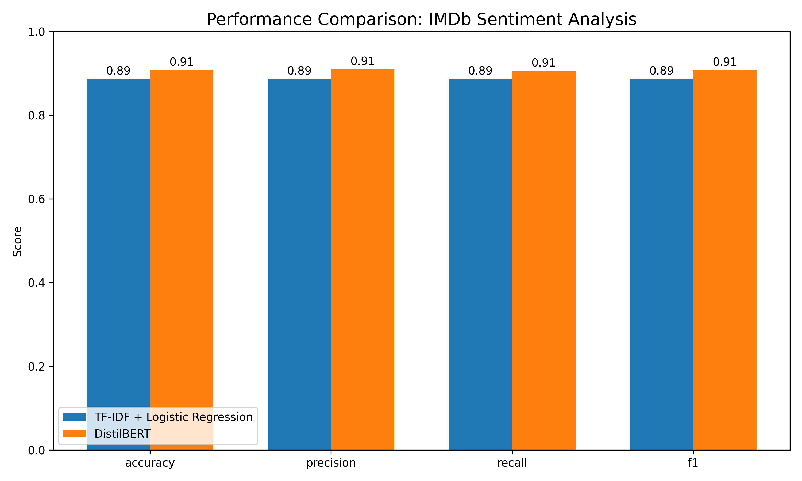

# Assignment 5 Report: IMDb Sentiment Analysis: Transformer vs. Traditional Methods

## Abstract
This study compares the performance of a transformer-based approach (DistilBERT) with a traditional machine learning pipeline (TF-IDF + Logistic Regression) for sentiment analysis on IMDb movie reviews. While the transformer model achieved higher accuracy (90.8% vs 88.7%), this improvement came at significantly higher computational cost. Analysis of performance across review lengths revealed that both models perform best on medium-length reviews, with transformers showing advantages primarily for longer documents. These findings suggest that the choice between approaches should consider both performance requirements and computational constraints.

## Introduction
Sentiment analysis is a fundamental NLP task with applications across domains from marketing to social media monitoring. This study compares transformer-based and traditional machine learning approaches for sentiment classification on movie reviews. Specifically, we investigate:

**Research Question**: How do transformer-based models (DistilBERT) compare to traditional ML pipelines (TF-IDF + Logistic Regression) for IMDb sentiment analysis in terms of performance and computational efficiency?

The importance of this question lies in determining the most appropriate approach for different NLP application contexts, balancing accuracy requirements against computational constraints. Recent advances in transformer architectures have shown impressive results across various NLP tasks, but their resource intensity raises questions about their practical applicability in all scenarios.

This study explores how modern transformer architectures compare to classic machine learning techniques by:

1. Using the IMDb movie review dataset with binary sentiment labels (positive/negative)
2. Implementing a DistilBERT transformer model for sentiment classification
3. Comparing against a TF-IDF + Logistic Regression baseline
4. Visualizing results and analyzing the performance differences based on review characteristics

## Methods
### Data Processing
We used the IMDb movie reviews dataset with binary sentiment labels (positive/negative) directly loaded from HuggingFace's datasets library. This dataset provides a standard benchmark for sentiment analysis tasks, featuring movie reviews with binary sentiment classifications. Our data processing pipeline included:

1. Loading the dataset directly using the `load_dataset()` function from HuggingFace
2. Standardizing column names ("text" → "review", "label" → "sentiment")  
3. Creating a balanced dataset of 10,000 reviews through stratified sampling (5,000 positive, 5,000 negative) to ensure equal representation of sentiment classes
4. Implementing a 90/10 train/validation split while preserving class balance through proportional stratification
5. Using a separate test set of 2,000 reviews with equal class distribution for consistent evaluation

This approach ensures consistent handling of both training and test datasets while maintaining the original class distribution when using subsets. The three-way split (train/validation/test) is particularly important for our implementation of early stopping in both models. The validation set allows us to monitor model performance during training and prevent overfitting without contaminating our test results, while the separate test set provides an unbiased evaluation of final model performance.

On first run, the system automatically downloads the IMDb dataset from HuggingFace and caches it locally for future use, streamlining the experimental setup process.

### Model Implementation
#### Baseline: TF-IDF + Logistic Regression
Our baseline model combined TF-IDF vectorization with logistic regression:

1. **Vectorization**: n-gram range of 1-3 (unigrams, bigrams, trigrams)
2. **Hyperparameter Optimization**: Bayesian search with 20 iterations using 3-fold cross-validation
3. **Search Space**:
   - max_features: 5,000-20,000 features
   - min_df: 2-15 minimum document frequency
   - max_df: 0.6-0.95 maximum document frequency  
   - sublinear_tf: True/False for log scaling
   - C: 0.01-100 regularization parameter (log-uniform prior)
4. **Training**: Multi-threaded training (n_jobs=-1) with early stopping based on validation performance

The baseline model applies sublinear TF scaling to term frequencies rather than using raw counts. This accounts for the diminishing returns of repeated terms in sentiment analysis—a sentiment word appearing ten times doesn't make a review ten times more positive/negative than if it appeared once. This scaling helps balance feature importance across reviews of varying lengths, preventing longer reviews from dominating purely because of word repetition while still preserving the relative importance of terms.

#### Transformer: DistilBERT
The transformer approach used a fine-tuned DistilBERT model:

1. **Model Initialization**: Pre-trained "distilbert-base-uncased" with added classification head
2. **Text Processing**:
   - Tokenization with padding and truncation to 512 tokens
   - Conversion to PyTorch tensors with attention masks
3. **Training Configuration**:
   - Batch size of 16
   - Learning rate of 1e-5 with AdamW optimizer
   - Weight decay of 0.01
   - Linear learning rate scheduler with 10% warmup
   - 3 epochs with early stopping (patience=3)
   - Gradient clipping with max_grad_norm=0.8
   - Evaluation strategy: once per epoch

#### Parameter Choice Rationale
For the transformer model, we employed reasonable parameters rather than extensive tuning due to computational constraints. Full hyperparameter optimization for transformers requires prohibitive resources (potentially days of GPU time), so we limited optimization to early stopping. We selected a batch size of 16 and maximum of 3 epochs as a balance between training stability and computational efficiency. Learning rate (1e-5) is within the recommended range for DistilBERT fine-tuning. The dynamic warmup schedule (10% of total steps) was implemented to stabilize early training and prevent gradient issues, while weight decay (0.01) helps control overfitting.

### Evaluation and Visualization
We evaluated both models using:

1. **Performance Metrics**: Accuracy, precision, recall, and F1 score on the test set
2. **Confusion Matrices**: Normalized matrices showing class-specific performance
3. **Length Analysis**: Performance stratified by review length categories (0-100, 101-200, 201-300, 301-500, 501-1000, 1000+ words)

The project generates several visualizations to compare model performance:

1. **Metrics Comparison** (metrics_comparison.png):
   - Bar chart comparing accuracy, precision, recall, and F1 for both models
   - Quantifies the performance difference between approaches

2. **Review Length Performance** (review_length_performance.png):
   - Compares model accuracy across different review length categories (0-100, 101-200, 201-300, 301-500, 501-1000, 1000+ words)
   - Reveals how text length affects performance for different model types

3. **Confusion Matrices** (confusion_matrices.png):
   - Normalized matrices showing class-specific performance
   - Provides insight into model classification behavior across sentiment classes

## Results
Our analysis reveals significant differences between the two approaches:

| Model | Accuracy | Precision | Recall | F1 | Training Time |
|-------|----------|-----------|--------|----|----|
| Logistic Regression | 0.887 | 0.887 | 0.887 | 0.887 | ~2.15 minutes* |
| DistilBERT | 0.908 | 0.910 | 0.906 | 0.908 | ~35 minutes |

*Table 1: Model performance metrics and training time comparison*
\* *Including Bayesian hyperparameter optimization with 20 iterations*

The transformer model achieved approximately 2.1 percentage points higher performance in accuracy, with similar improvements across other metrics. However, this improvement comes at a substantial computational cost, with training time increasing from minutes to tens of minutes.

*Figure 1: Performance metrics comparison between Logistic Regression and DistilBERT models*

### Performance by Review Length
Our analysis of how review length affects model performance showed interesting patterns:

*Figure 2: Model accuracy across different review length categories*

Key findings:

- Both models achieve peak accuracy (>95%) on medium-length reviews (201-300 words)
- DistilBERT demonstrates stronger performance on longer reviews (501+ words)
- The traditional TF-IDF model performs comparably or slightly better on shorter reviews (101-500 words)
- Performance analysis suggests that medium-length reviews provide optimal information without excess noise

*Figure 3: Confusion matrices for Logistic Regression (left) and DistilBERT (right) models*

## Discussion
The results demonstrate that while transformer models provide measurable but modest performance improvements for sentiment analysis (~2.1% better accuracy), the magnitude of this improvement may not always justify their substantially higher computational requirements for all use cases.

### Implications

1. **Resource Tradeoffs**: For applications requiring real-time processing or deployment on resource-constrained environments, the traditional pipeline remains highly competitive with 88.7% accuracy while training in approximately 2 minutes.

2. **Review Length Sensitivity**: The transformer model's advantage is most pronounced for longer reviews (501+ words), where attention mechanisms likely help capture long-range dependencies better than bag-of-words approaches.

3. **Production Considerations**: The relatively fast training time of the logistic regression model makes it suitable for frequent retraining with updated data, while the transformer approach requires more careful planning around when to retrain.

4. **Diminishing Returns**: The 2.1% accuracy improvement from transformers represents an 18.6% reduction in error rate, which may be significant for certain high-stakes applications but negligible for others.

Several observations are notable:

1. We observed training instability in the transformer, with gradient norm spikes reaching 23.5, suggesting potential benefit from more aggressive gradient clipping
2. Analyzing Figure 2 reveals that both models achieve peak performance on medium-length reviews (201-300 words), suggesting this length provides optimal information without excess noise
3. The sample distribution is highly uneven across length categories (n=6 for shortest vs. n=910 for longest), which may affect the reliability of comparisons in the smallest categories

For practical implementation, decision factors should include:

1. Available computational resources for training and inference
2. Performance requirements (is the modest accuracy gain worth the resource investment?)
3. Typical document length in the target application
4. Frequency of model retraining needs

### Limitations
Our study has several limitations:

- The current analysis uses a simplified subset of the full IMDb dataset
- We focused only on binary sentiment classification
- The transformer implementation uses a small-scale DistilBERT model rather than larger architectures
- Fixed parameters were used for the transformer model, while the logistic regression pipeline receives full hyperparameter optimization
- The sample distribution is highly uneven across length categories, which may affect the reliability of comparisons in the smallest categories

### Future Work
Future extensions could explore:

- Fine-grained sentiment analysis beyond binary classification
- Performance comparison on other domains beyond movie reviews
- Hybrid approaches combining the speed of traditional methods with the power of transformers
- Systematic hyperparameter optimization for the transformer model
- Learning rate scheduling and advanced training techniques for the transformer model

## Conclusion
This study demonstrates that while transformer models do outperform traditional approaches for sentiment analysis, the performance gap is modest (~2.1 percentage points) and comes with substantially higher computational costs. The choice between approaches should be guided by specific application requirements, available resources, and the characteristics of the text being analyzed, particularly length. For many practical applications, especially those with shorter texts or resource constraints, traditional approaches remain competitive and cost-effective alternatives to transformer models.

## References

- Maas, A. L., Daly, R. E., Pham, P. T., Huang, D., Ng, A. Y., & Potts, C. (2011). Learning Word Vectors for Sentiment Analysis. Proceedings of the 49th Annual Meeting of the Association for Computational Linguistics: Human Language Technologies, 142-150.
- Devlin, J., Chang, M. W., Lee, K., & Toutanova, K. (2018). BERT: Pre-training of deep bidirectional transformers for language understanding. arXiv preprint arXiv:1810.04805.
- Sanh, V., Debut, L., Chaumond, J., & Wolf, T. (2019). DistilBERT, a distilled version of BERT: smaller, faster, cheaper and lighter. arXiv preprint arXiv:1910.01108.